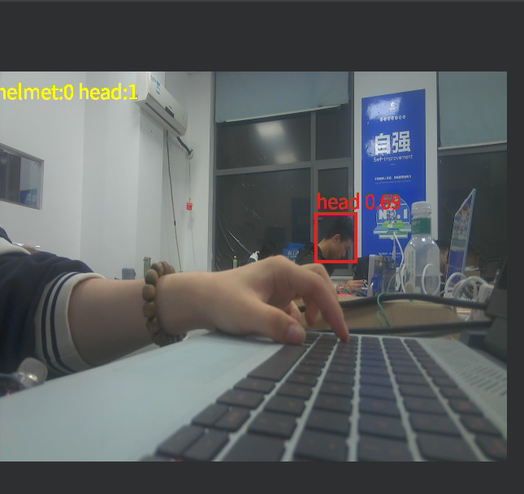
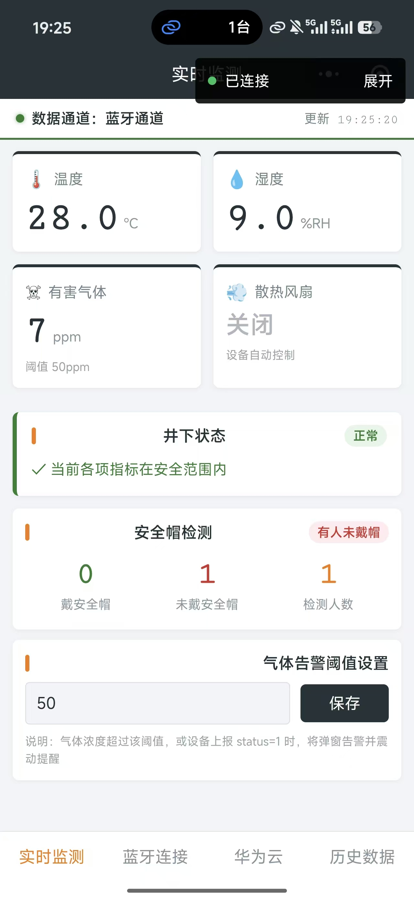
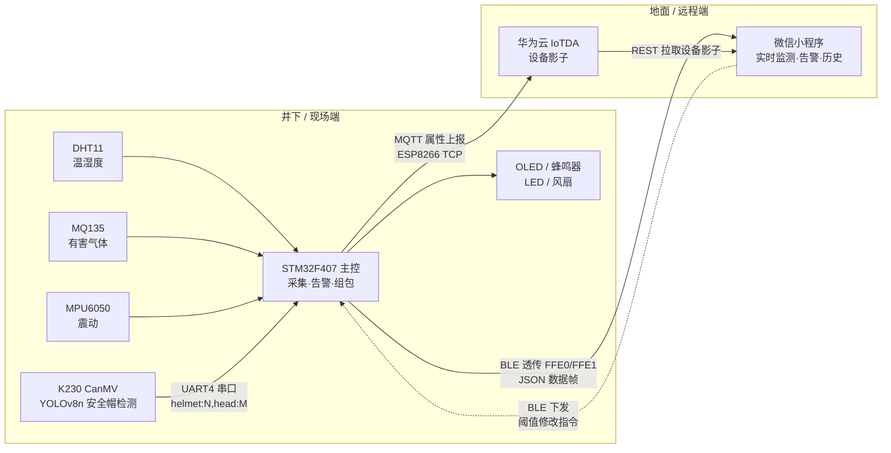
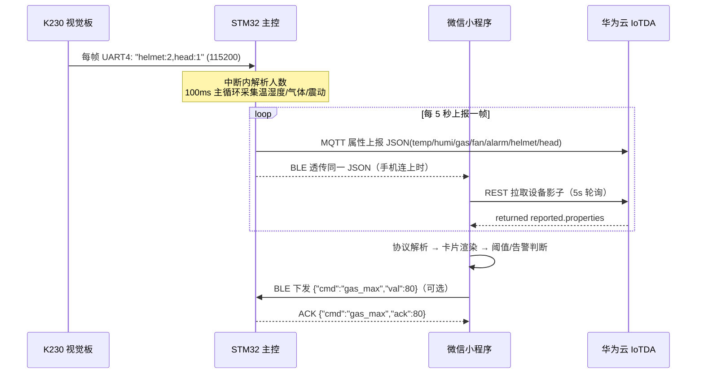

# 井下环境智能监测系统（STM32 + 微信小程序 + K230 视觉）

> 一套完整的"下位机 + 上位机"矿山井下安全监测方案：
> **STM32** 采集温湿度 / 有害气体 / 震动数据，**K230** 视觉板运行 YOLOv8 模型检测安全帽佩戴情况，
> 数据经 **蓝牙 BLE** 与 **华为云 IoTDA** 双通道实时上报到 **微信小程序**，支持告警弹窗、阈值下发与历史记录。

<div align="center">

| K230 安全帽检测（实时推理） | 微信小程序（真机运行） |
|:---:|:---:|
|  |  |
| 绿框=戴帽 红框=未戴帽，右上角实时统计 | 环境数据 + 安全帽人数 + 告警状态 + 阈值设置 |

</div>

---

## 目录

- [系统架构](#系统架构)
- [数据链路](#数据链路)
- [硬件与接线](#硬件与接线)
- [数据协议（v2.1）](#数据协议v21)
- [告警与联动逻辑](#告警与联动逻辑)
- [仓库目录结构](#仓库目录结构)
- [快速上手](#快速上手)
- [常见问题 FAQ](#常见问题-faq)
- [文档索引](#文档索引)

---

## 系统架构



双通道互为备份：现场近距用蓝牙直连（实时性最好），远程监管走华为云（不受距离限制）。
两条通道的数据帧格式完全一致，小程序端解析层统一处理。

## 数据链路



---

## 硬件与接线

### 硬件清单

| 模块 | 型号 | 作用 |
|---|---|---|
| 主控 | STM32F407VET6 | 传感器采集、数据融合、双通道上报、本地告警 |
| 视觉 | Yahboom K230 (CanMV) | YOLOv8n 安全帽检测，mAP50=0.957 |
| 温湿度 | DHT11 | 环境温度 / 湿度 |
| 气体 | MQ135 | 有害气体等效浓度（温湿度补偿） |
| 震动 | MPU6050 | 三轴加速度震动检测（锁存算法） |
| 蓝牙 | DX-BT24 | BLE 透传（FFE0/FFE1） |
| WiFi | ESP8266 | MQTT 上报华为云（TCP + AT） |
| 显示 | 0.96" OLED | 本地实时显示 4 行状态 |
| 声光 | 蜂鸣器 + LED | 超标告警 |

### 接线表（全部 3.3V 电平，断电接线，必须共地）

| 通路 | STM32 引脚 | 对端 | 波特率 |
|---|---|---|---|
| 调试串口 | PA9(TX) / PA10(RX) | USB-TTL → 电脑 | 115200 |
| 蓝牙 BT24 | PA2(TX)→RXD / PA3(RX)←TXD | DX-BT24 模块 | 9600 |
| WiFi ESP8266 | PD8(TX) / PD9(RX) | ESP8266 模块 | 115200 |
| K230 视觉 | PC10(TX) / **PC11(RX)←K230 TX** | K230 排针 pin11(TX) / pin12(RX) | 115200 |
| 气体传感器 | PA4 (ADC1_IN4) | MQ135 模块 **AO**（勿接 DO！） | — |
| 温湿度 | PA5 | DHT11 DATA | — |
| 重校按键 | PG2 (KEY0) | 长按 1.5s 重新校准气体基线 | — |

> 注意：K230 → STM32 只需要 **TX → PC11** 一根信号线（数据单向流动），
> RX 和 GND 按需连接；MQ135 模块若 5V 供电，AO 输出可能超过 3.3V，建议改 3.3V 供电或加分压。

---

## 数据协议（v2.1）

固件与小程序之间的统一数据格式（蓝牙 / 华为云 payload 完全一致）：

```json
{"temp":25.0,"humi":60.0,"gas":110,"status":0,"fan":0,"alarm":2,"helmet":2,"head":1}
```

| 字段 | 类型 | 单位 | 范围 | 含义 | 版本 |
|---|---|---|---|---|---|
| `temp` | number | ℃ | -50~150 | 环境温度，1 位小数 | v1 |
| `humi` | number | %RH | 0~100 | 相对湿度，1 位小数 | v1 |
| `gas` | number | ppm | ≥0 | 有害气体等效浓度 | v1 |
| `status` | number | — | 0/1 | 0-正常，1-任一告警（兼容旧协议） | v1 |
| `fan` | number | — | 0/1 | 散热风扇状态 | v2 |
| `alarm` | number | — | 0~7 | 告警位掩码（见下） | v2 |
| `helmet` | number | 人 | 0~99 | K230 识别：**戴**安全帽人数 | v2.1 |
| `head` | number | 人 | 0~99 | K230 识别：**未戴**安全帽人数 | v2.1 |

**alarm 位掩码**：`bit0` 温度过高 / `bit1` 气体超标 / `bit2` 震动告警，可同时置位（如 `0b011`=温度+气体）。

**下行指令**（小程序 → 固件，经 BLE 透传）：

```json
{"cmd":"gas_max","val":80}    // 修改气体告警阈值，固件回 {"cmd":"gas_max","ack":80}
```

> 完整协议文档（含帧约束、容错约定、联调自测清单）见
> [xiaocehngx/docs/STM32数据上报协议.md](xiaocehngx/docs/STM32数据上报协议.md)

---

## 告警与联动逻辑

| 条件 | 现场响应 | 小程序响应 |
|---|---|---|
| 温度 > 32℃ | 蜂鸣器响、LED 闪、风扇开 | `alarm` bit0，弹窗+震动提醒 |
| 气体 > 阈值（默认 50ppm，可下发修改） | 同上 | `alarm` bit1，弹窗+震动提醒 |
| MPU6050 检测到异常震动 | 蜂鸣器响 | `alarm` bit2，弹窗提醒 |
| 有人未戴安全帽（`head` > 0） | OLED 显示 H:xU:y | 卡片标红「有人未戴帽」 |

- OLED 四行显示：温度 / 湿度 / 气体 ppm / 状态 + `H:2U:1`（K230 人数，离线显示 `H:-U:-`）
- 震动检测采用「连续 3 次超限确认 + 5 周期无震动解除」的锁存算法，避免误报
- 固件启动时 MQ135 固定预热 120 秒后自动校准基线（OLED 显示倒计时），运行中长按 KEY0 可随时重校

---

## 仓库目录结构

```
kuang/
├── kuan/                      ★ STM32 主固件（Keil MDK 工程）
│   ├── User/main.c               主循环：采集、告警、组包上报
│   ├── Driver/                   外设驱动（USART/UART4、ADC、DHT11、OLED、BEEP…）
│   ├── System/                   ESP8266 + MQTT 华为云、MPU6050 软 I2C
│   └── Project/STM.uvprojx       Keil 工程文件（AC5 + MicroLIB）
├── xiaocehngx/                ★ 微信小程序
│   ├── pages/index               实时监测（卡片、告警弹窗、阈值设置）
│   ├── pages/connect             蓝牙连接
│   ├── pages/cloud               华为云配置（IAM 参数）
│   ├── pages/history             历史数据（本地 30 条）
│   ├── utils/protocol.js         协议解析（BLE 半包粘包 / MQTT / 影子三路统一）
│   ├── utils/bleService.js       BLE 服务（FFE0/FFE1）
│   ├── utils/cloudPoll.js        设备影子 5s 轮询
│   └── docs/                     协议文档 + 部署说明
├── 230/helmet_project/        ★ K230 安全帽检测全链路
│   ├── train.py / export_onnx.py / compile_kmodel.py   训练→ONNX→kmodel
│   ├── helmet_inference.py       板端推理脚本（含 UART 输出）
│   ├── K230部署指南.md           三步部署 + 接线
│   └── 训练报告.md               数据集、指标、PTQ 量化细节
├── bt24_test/                 DX-BT24 蓝牙模块独立测试固件（判定模块好坏）
└── docs/images/               README 配图
```

---

## 快速上手

### ① 烧录 STM32 固件

1. Keil MDK（AC5，MicroLIB 已开启）打开 `kuan/Project/STM.uvprojx`
2. F7 编译（当前版本 0 Error），ST-Link/J-Link 烧录 `Objects/STM.hex`
3. 上电观察 OLED 四行数据 + 调试串口（PA9，115200）日志

### ② 部署 K230 视觉板

1. 把 `runs/helmet_yolov8n/kmodel/helmet_yolov8n_uint8.kmodel` 拷到 SD 卡根目录
2. CanMV IDE 打开 `helmet_inference.py`，连接板子点运行
3. 用排线把 K230 TX (pin11) 接到 STM32 PC11，共地
4. 详见 [230/helmet_project/K230部署指南.md](230/helmet_project/K230部署指南.md)

### ③ 运行微信小程序

1. 微信开发者工具导入 `xiaocehngx/`
2. **蓝牙通道**：手机蓝牙开 → 小程序「蓝牙连接」页搜索 KDL05 连接
3. **华为云通道**：在「华为云」页填入 IAM 账号 / projectId / deviceId / 接入地址
   （产品模型需含服务 `show`，属性 `temp/humi/gas/fan/alarm/helmet/head`）

### ④ 云侧要求

- 华为云 IoTDA：产品模型属性与上报 JSON 字段一一对应——**平台只存储模型中定义过的属性**，
  缺一个字段云端就丢一个字段
- ESP8266 需接入 2.4G WiFi（固件内 `esp8266.h` 修改 SSID/密码）

---

## 常见问题 FAQ

<details>
<summary><b>气体浓度一直显示 9999？</b></summary>

三步排查：① 看 `MQ135_Get_ADC` 是否读到 >4095 的值——本板 ADC1 按左对齐出数，
固件已内置右移兼容补丁（`MQ135_Get_ADC_Avg` 与 `MQ135_Get_ADC` 都有）；② 确认接的是模块 **AO** 口而非 DO；③ 上电预热 120 秒后再看（冷态校准会让基线严重偏大）。修复历史见提交 `2648db7`、`06d8c5b`。
</details>

<details>
<summary><b>蓝牙搜不到 / 连不上设备？</b></summary>

先跑 `bt24_test/` 最小测试固件判定模块好坏（README 有判定表）。注意：BT24 的 AT 指令
只在**蓝牙未被连接**时有效，连上后进入纯透传。小程序按广播名（如 KDL05）扫描。
</details>

<details>
<summary><b>K230 画面正常但检不出框？</b></summary>

`rgb888p_size` 与 `display_size` 不一致时 AI 通道可能取帧异常，两者先用 640×480；
确认 kmodel 已拷到 `/sdcard/` 且 LABELS 顺序与训练 `data.yaml` 一致（helmet 在前）。
</details>

<details>
<summary><b>华为云通道看不到安全帽人数？</b></summary>

产品模型里必须**添加并发布** `helmet`/`head` 属性（服务 `show` 下），平台只存模型定义过的字段；
小程序需重新编译让新解析代码生效。可在控制台「设备影子」里确认 reported.properties 是否含这两个字段。
</details>

<details>
<summary><b>MQTT 上报后设备频繁掉线？</b></summary>

同一设备 ID 只允许一条 MQTT 连接：小程序走的是 REST 影子接口（不抢连接），
切勿用 MQTT 客户端冒充设备 ID 登录调试，否则 STM32 会被挤下线。
</details>

---

## 文档索引

| 文档 | 说明 |
|---|---|
| [xiaocehngx/docs/STM32数据上报协议.md](xiaocehngx/docs/STM32数据上报协议.md) | 数据协议 v2.1 完整定义（固件开发者必读） |
| [230/helmet_project/K230部署指南.md](230/helmet_project/K230部署指南.md) | K230 三步部署 + 与 STM32 接线 |
| [230/helmet_project/训练报告.md](230/helmet_project/训练报告.md) | YOLOv8n 训练指标与量化验证 |
| [xiaocehngx/docs/部署使用说明.md](xiaocehngx/docs/部署使用说明.md) | 小程序与云端配置说明 |
| [bt24_test/README.md](bt24_test/README.md) | BT24 蓝牙模块测试固件 |

---

<div align="center">

**开发环境**：Keil MDK 5 (AC5) · CanMV IDE (micropython V1.4.3) · nncase 2.10 · 微信开发者工具 · 华为云 IoTDA

</div>
